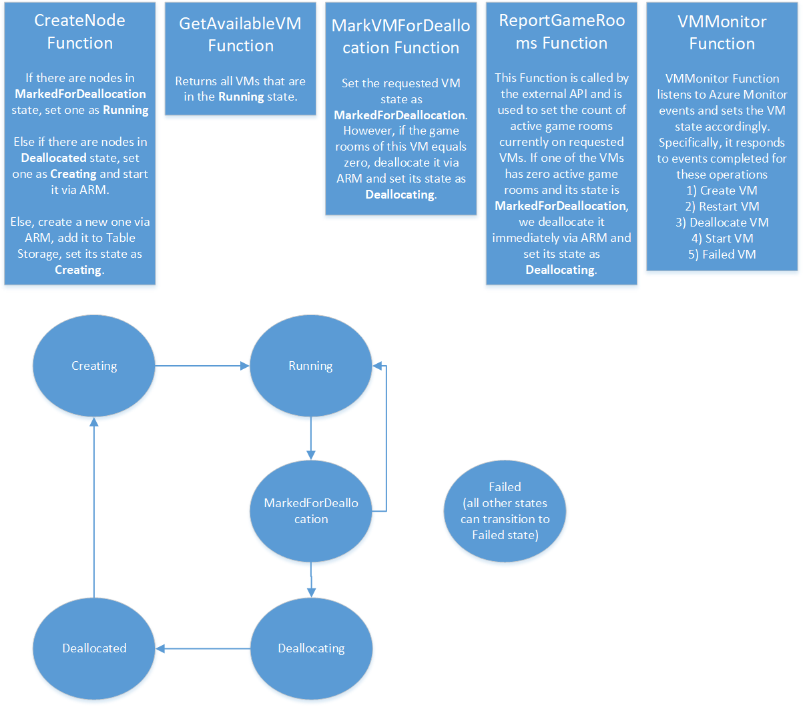

# AzureGameRoomsScaler
Provides API to deploy new VMs and deallocate them considering the number of active game rooms

If you want to know how you can use, you can check out an [example with Minecraft server](https://github.com/PoisonousJohn/AzureGameRoomsScaler-MinecraftSample).

## Motivation

Dedicated game servers are stateful, thus they differ pretty much from typical stateless VMs. You can't just shut down VM if somebody is playing at the moment. This project tries to solve the issue by creating more VMs to host game servers.

## Overview

AzureGameRoomsScaler is just a tiny application which can be plugged to your exising system which monitors server resources.

It will give you opportunity to:
- Roll out new VM based on a specific image
- Gracefully shutdown specific VM, waiting until there would be no game sessions running

To make gracefull shutdown work, you need to report game rooms number per VM when it changes.

## Detailed architecture
 
The application heavily relies on an external service built by the user (this would probably be the game's matchmaking/lobby service). This service will have the responsibility to call the described operations. Moreover, the application has a storage mechanism (Azure Table Storage) to store information about running VMs. This currently contains:

- Resource Group (set as the Table Storage PartitionKey)
- VM unique ID (set as the Table Storage RowKey)
- VM state
- Public IP
- Azure Region
- Size

VM state is equal one of the following values
- Creating
- Running
- MarkedForDeallocation
- Deallocating
- Deallocated
- Failed

The API Function has the following operations

- *CreateVM*. If there are nodes in MarkedForDeallocation state, set one as Running. Else if there are nodes in Deallocated state, set one as Creating and start it via ARM. Else, create a new one via ARM, add it to Table Storage, set its state as Creating.
- *GetAvailableVMs*. Returns all VMs that are in the Running state.
- *ReportGameRooms*. This Function is called by the external API and is used to set the count of active game rooms currently on requested VMs. If one of the VMs has zero active game rooms and its state is MarkedForDeallocation, we deallocate it immediately via ARM and set its state as Deallocating.
- *MarkVMForDeallocation*. Set the requested VM state as MarkedForDeallocation. However, if the game rooms of this VM equals zero, deallocate it via ARM API and set its state as Deallocating.
- *VMMonitor*. VMMonitor Function listens to Azure Monitor events and sets the VM state accordingly. Specifically, it responds to events completed for these operations
1) Create VM
2) Restart VM
3) Deallocate VM
4) Start VM
5) Failed VM

You can see the states transition and the Functions description here

## FAQ 

### *Since we are not deleting VMs but we are deallocating them, what happens with the game state?*
We take if for granted that when a VM (re)boots it clears all its pre-existing state.

### *Can I use this project outside of the gaming context?*
Absolutely! We have no direct connection to gaming context, you can use it for whatever workload you desire. 